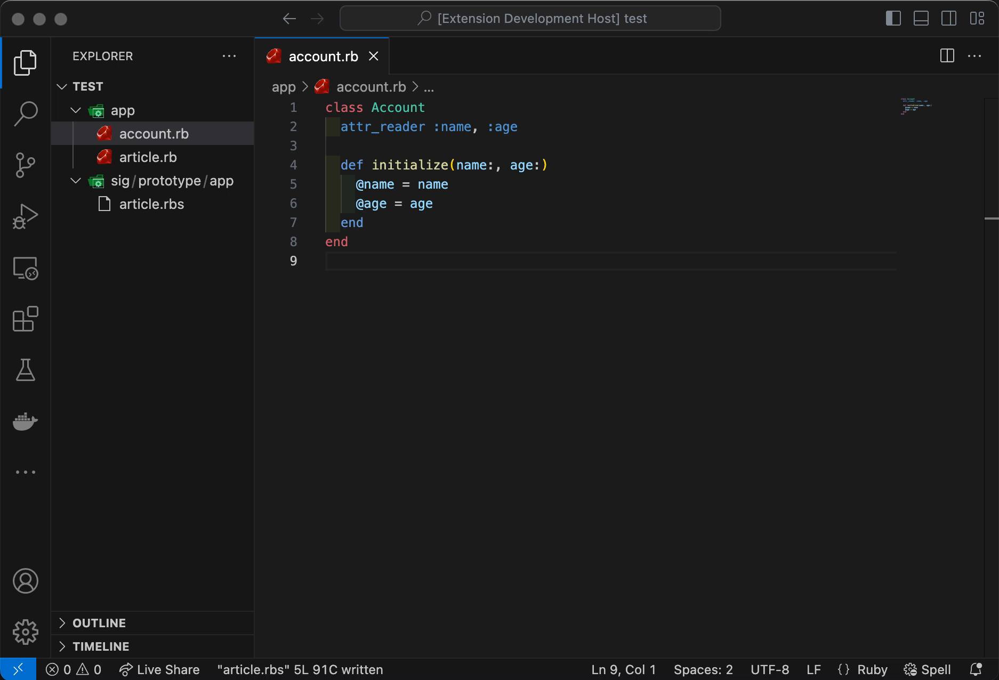

# open-rbs-file README

This extension allows you to open RBS file against the current file.

## Features

* Open RBS file against the current file
* Copy prototype RBS file on creating RBS file

## Extension Settings

This extension contributes the following settings:

* `open-rbs-file.signature-directory`: The name of the signature directory
* `open-rbs-file.signature-prototype-directory`: The name of the signature prototype directory
* `open-rbs-file.copy-signature-prototype-on-create`: Copy the signature prototype file on creating a new RBS file

## Release Notes

### 1.0.0

Initial release of open-rbs-file
